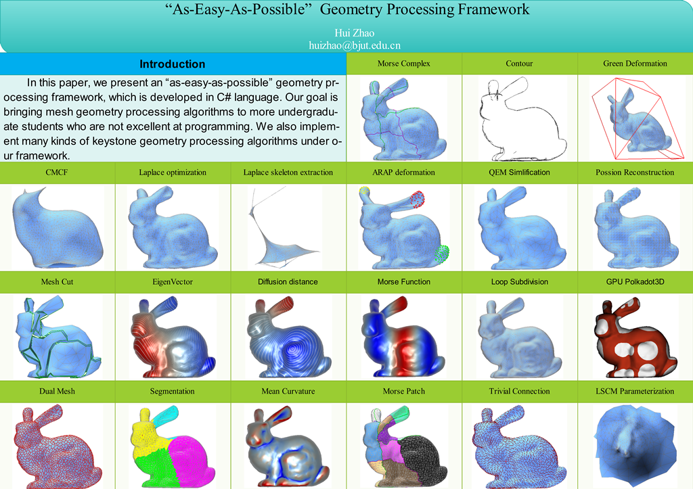

# MeshDGP - A simple C# geometry processing framework



<https://github.com/meshdgp/MeshDGP>

> Get started with:
>
```bash
git clone --recursive https://github.com/meshdgp/MeshDGP.git
```

MeshDGP is a simple C# geometry processing library. This mesh processing framework(MeshDGP) is developed by the Team of Hui Zhao. All Right is Reserved! A lot of students have contributed to MeshDGP. They are Luwei Yang, Tong Wu, Fada Li, Nan Dong, Han Meng, Xun Meng, Zihao Li, Haibo Jiang, Anan Zhou, Leyuan Liu. Thanks to them

MeshDGP demonstrates the dozens of keystone mesh processing algorithms. it could be used as a learning or research framework for students ,researchers and engineers

MeshDGP can also be used to learn the basic algorithms in 3ds Max, Maya

 ## Features
1. This mesh processing framework(MeshDGP) is developed by the Team of Hui Zhao. All Right is Reserved!

2. MeshDGP is developed with C Sharp and includes the dozens of Keystone Siggraph Mesh Processing Algorithms.

3. HalfEdge, Subdivision, Simplification, Mesh Cut, Segmentation, Laplace deformation, FFD, Green deformation, Mean value Deformation, Mesh Smoothing, Skeleton, Skinning, Morse Function, Spectral Analysis, Vector Field Design, Quadrangulation, Feature Line,GPU Rendering, OpenGL UI

4. All Linear Parameterization: Harmonic,Linear ABF, LSCM, DCP/DAP,ARAP, Spectral, Gaussian Curvature Based

5. Discrete Exterior Calculus: Trivial Connection, Geodistance, Conformal Flow

6. Geodistance: Biharmonic, Diffusion, Commute-Time

7. We also provides a series of book to support and explain the algorithms and implementations in MeshDGP.

8. Any question,Please email to graphicsresearch@qq.com

## Textbook

We provides several textbooks based on MeshDGP:
[Textbook](http://item.jd.com/11587555.html)  .


## Installation

MeshDGP is a C# framework. You do  not need to build anything to install.  The source code is rafactored to be as readable as possible.

 

## Dependencies
We provide a wrapper for libigl(https://github.com/libigl/libigl)  in MeshDGP
  
  

## How to contribute

If you are interested in joining development, please fork the repository and
submit a [pull request](https://help.github.com/articles/using-pull-requests/)
with your changes.

## License
To be Determined!

## Attribution
If you use MeshDGP in your academic projects, please cite the papers we
implement as appropriate. To cite the library in general, you could use this
BibTeX entry:

```bibtex

@misc{Hui:MeshDGP:2016,
   Author = {Hui, Zhao},
   Year = {2016},
   Note = {http://meshdgp.github.io/},
   Title = {MeshDGP mesh processing framework}
} 

```

 
## Contact

MeshDGP is a group endeavor led by [Hui Zhao](http://scholar.harvard.edu/huizhao/)   Please [contact
us](mailto:graphicsresearch@qq.com) if you have
questions or comments. For troubleshooting, please post an
[issue](https://github.com/meshdgp/MeshDGP/issues) on github.

If you're using MeshDGP in your projects, quickly [drop us a
note](mailto:graphicsresearch@qq.com). Tell us who you
are and what you're using it for. This helps us apply for funding and justify
spending time maintaining this.

If you find bugs or have problems please use our [github issue tracking
page](https://github.com/meshdgp/MeshDGP/issues).

## Copyright
2016 Hui Zhao and others.

Please see individual files for appropriate copyright notices.
